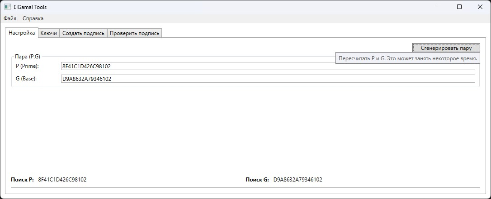

# ElGamalTools

App implemente of calculating and verifying electronic signatures using the ElGamal algorithm.

The ElGamal encryption algorithm is a public key encryption scheme that consists of two parts: key generation and encryption/decryption.

The application allows you to generate a P and G pair, a private and public key. Sign files and verify the signature.

